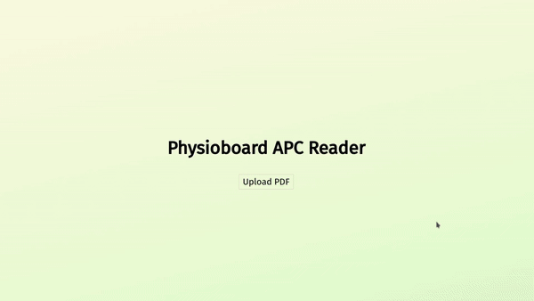
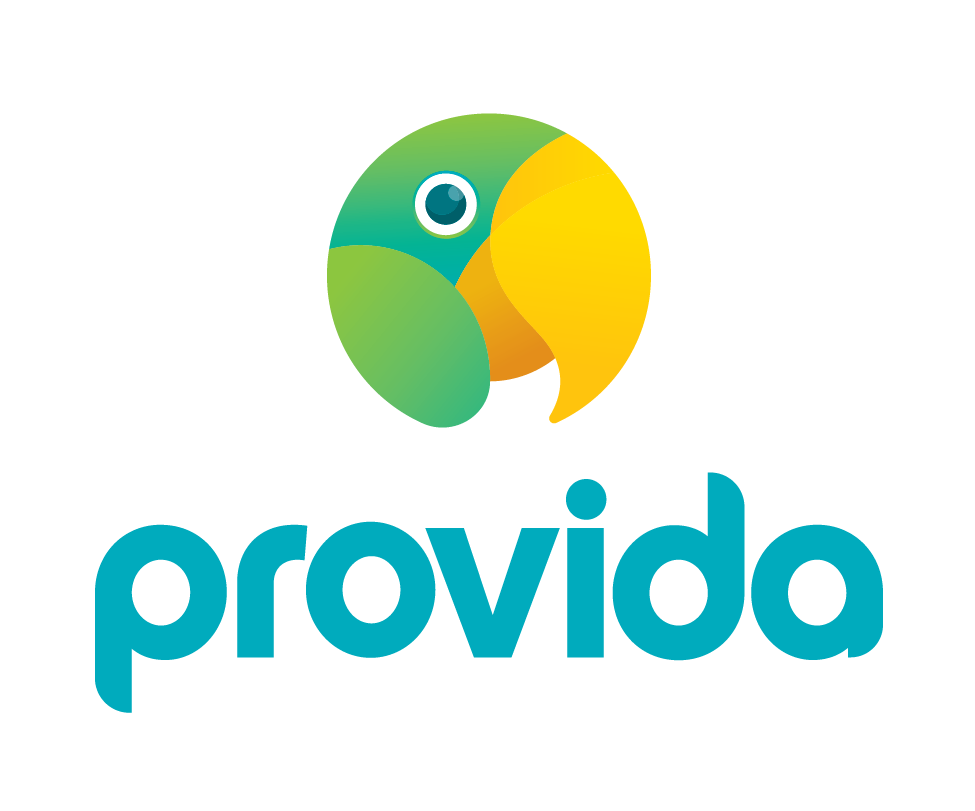

# NZ Physioboard APC Reader  [![License][]](LICENSE) [![NPM Package]](https://npmjs.org/package/physioboard-apc-reader)

[license]: https://img.shields.io/badge/license-MIT-blue.svg?style=flat-square
[npm package]: https://img.shields.io/npm/v/@openhealthnz-credentials/physioboard-apc-reader.svg?style=flat-square


Parses and extracts info from NZ Physio board issued certificates.


## Installation

This package is designed for a node-js enviroment. Install with yarn or npm

```bash
  npm install @openhealthnz-credentials/physioboard-apc-reader # or
  yarn add @openhealthnz-credentials/physioboard-apc-reader
```
    
## Usage

### From a file:

```javascript
import { ApcFromPDFBuffer } from '@openhealthnz-credentials/physioboard-apc-reader'
...
let details = await ApcFromPDFBuffer(fileBuffer);
```

### From a file buffer 

```javascript
import { ApcFromPDFFile } from '@openhealthnz-credentials/physioboard-apc-reader'
...
let details = await ApcFromPDFFile("./path/to/file.pdf");
```

### Error Handling
```javascript
import { ApcFromPDFFile } from '@openhealthnz-credentials/physioboard-apc-reader'

try {
    let details = await ApcFromPDFFile("./path/to/file.pdf");
    if (details) {
        // Sucessfully parsed
        console.log(details)
    } else {
        // details===null
        // Means it failed to parse
        // Likely not the correct kind of certifcate
    }
} catch (e) {
    // PDF was invalid, or file could not be read
}
```
## Demo

[Demo site here!](https://physioboard-apc-reader.pages.dev/)



## Contributing

Contributions are always welcome!

See `contributing.md` for ways to get started.

Please adhere to this project's `code of conduct`.


<br/>
<br/>
<h2 align="center">
	Supported By
</h2>
<p align="center">
	<a href="https://www.provida.nz/">
		</img>
	</a>
</p>